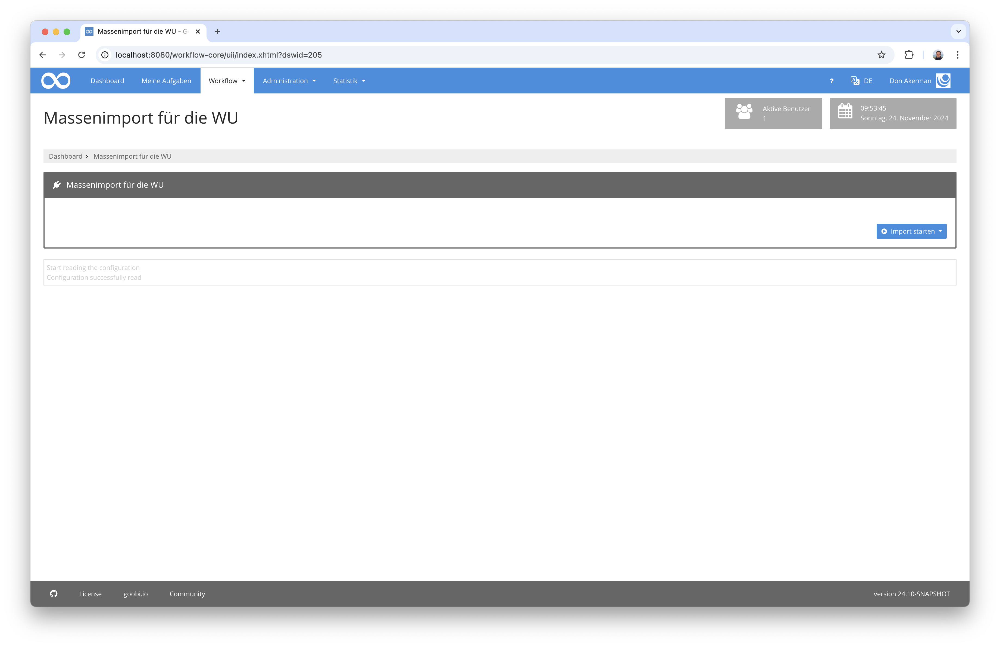

## Einführung
Dieses Workflow-Plugin erlaubt einen Massenimport für die Markenstudien und das Werbemittelarchiv an der Wirtschaftsuniversität Wien.

## Installation
Um das Plugin nutzen zu können, müssen folgende Dateien installiert werden:

```bash
/opt/digiverso/goobi/plugins/workflow/plugin-workflow-wu-wma-import-base.jar
/opt/digiverso/goobi/plugins/GUI/plugin-workflow-wu-wma-import-gui.jar
/opt/digiverso/goobi/config/plugin_intranda_workflow_wu_wma_import.xml
```

Für eine Nutzung dieses Plugins muss der Nutzer über die korrekte Rollenberechtigung verfügen.


Bitte weisen Sie daher der Gruppe die Rolle `Plugin_workflow_wu_wma_import` zu.


## Überblick und Funktionsweise
Wenn das Plugin korrekt installiert und konfiguriert wurde, ist es innerhalb des Menüpunkts `Workflow` zu finden.



Hier kann nun auf der rechten Seite ein Import für ein Datenset gestartet werden.


Nach Beginn des Imports der Daten ist ein Fortschritt über den Forschrittsbalken ersichtlich. Details über den Import der einzelnen Datensätze lassen sich im darunter aufgeführten Log einsehen.

## Konfiguration
Die Konfiguration des Plugins erfolgt in der Datei `plugin_intranda_workflow_wu_wma_import.xml` wie hier aufgezeigt:

{{CONFIG_CONTENT}}

Die folgende Tabelle enthält eine Zusammenstellung der Parameter und ihrer Beschreibungen:

Parameter   | Erläuterung
------------|-----------------------------------------------------------------------------------------------------------------------------------------------------------------------------------------------------------------------------------------------------------------------------------------------------------------------------------------------------------------------------------------------------------------------------------------
`title`     | Hier kann ein individueller Titel für die Anzeige im Menü und die Überschriften des Plugins festgelegt werden.
`cleanup`   | Mit diesem Parameter kann festgelegt werden, ob diejenigen Daten, die importiert wurden, aus dem Quellverzeichnis (dem jeweiligen `Importset`) gelöscht werden sollen. Fehlt der Parameter, ist der Standardwert `false`.
`importSet` | Mit diesem Element lassen sich individuelle Importsets definieren. Sie bestehen jeweils aus einem `title` für den anzuzeigenden Namen, sowie einer Angabe für den Speicherort, von dem die Daten importiert werden sollen. Der Speicherort kann dabei beliebig tiefe Verzeichnisstrukturen aufweisen. Ausserdem läßt sich mit `workflow` festlegen, welche Produktionsvorlage für das Anlegen von Goobi-Vorgängen verwendet werden soll.

