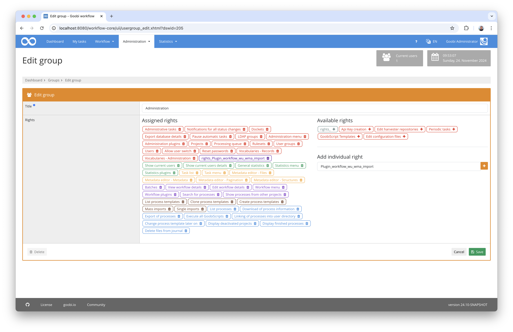

## Introduction
This workflow plugin allows you to ZZZ.

## Installation
In order to use the plugin, the following files must be installed:

```bash
/opt/digiverso/goobi/plugins/workflow/plugin-workflow-ZZZ-base.jar
/opt/digiverso/goobi/plugins/GUI/plugin-workflow-ZZZ-gui.jar
/opt/digiverso/goobi/config/plugin_intranda_workflow_ZZZ.xml
```

To use this plugin, the user must have the correct role authorisation.


Therefore, please assign the role `ZZZ` to the group.




## Overview and functionality
If the plugin has been installed and configured correctly, it can be found under the `Workflow` menu item.


ZZZ


## Configuration
The plugin is configured in the file `plugin_intranda_workflow_ZZZ.xml` as shown here:

{{CONFIG_CONTENT}}

The following table contains a summary of the parameters and their descriptions:

Parameter               | Explanation
------------------------|------------------------------------
``                      | 
``                      | 
``                      | 
``                      | 
``                      | 
``                      | 
``                      | 
``                      | 
``                      | 
``                      | 
``                      | 
``                      | 
``                      | 
``                      | 
``                      | 
``                      | 
``                      | 
``                      | 
``                      | 
``                      | 
``                      | 
``                      | 
``                      | 
``                      | 
``                      | 
``                      | 
``                      | 
